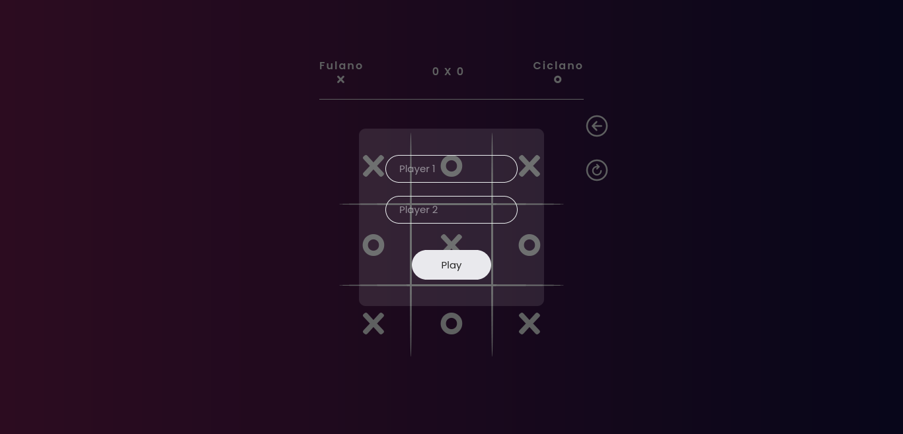
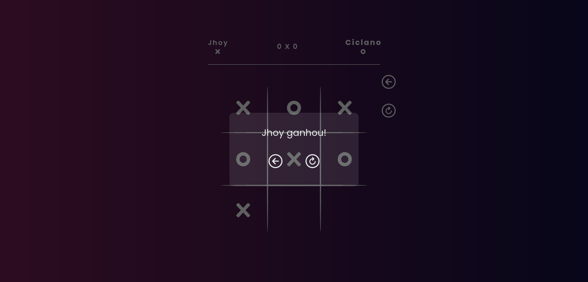

# Projeto Jogo da Velha

Tela Inicial

  

Tela do Ganhador

  

> Projeto desenvolvido com intuito de aprimorar minhas habilidades com a linguagem JavaScript.
### Ajustes e melhorias
Projeto concluído na data 18/02/2023:

- [x] Front-end
  - [x] HTML
    - [x] Desenvolver o layout do jogo
  - [x] CSS
- [x] Back-end
  - [x] Funcionalidades básicas do jogo
  - [x] Animação player name

### 🤝 Colaboradores

<table>
  <tr>
    <td align="center">
      <a href="https://github.com/Jhoy-Kallebe">
         
        
          <b>Jhoy Kallebe</b>
        
      </a>
    </td>
  </tr>
</table>

### 📝 Licese

MIT

## Jogue <a href="https://jhoy-kallebe.github.io/Jogo_da_Velha/app/src/">AQUI!</a>

[⬆ Voltar ao topo](#projeto-jogo-da-velha) 
